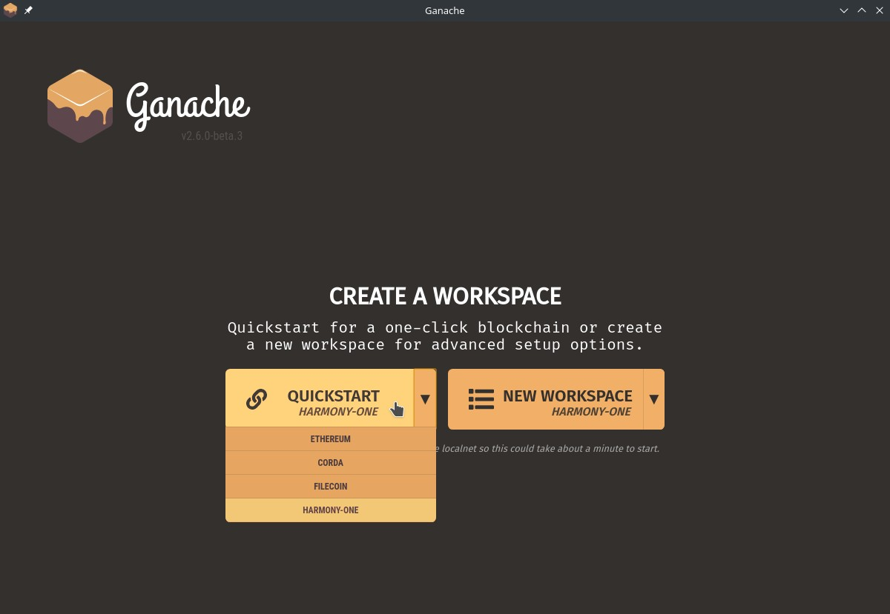
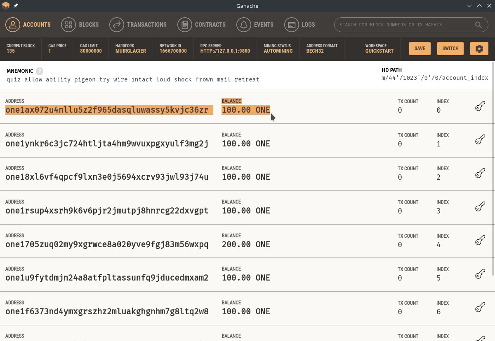

# harmony-one-ganache-support
Integrates Ganache and Harmony in a seamless setup.

With this setup you will be up and running very quickly with a Harmony One localnet deployment with full Ganache integration, a preconfigured set of account for testing and an example dApp.

## This repository includes
* An open repo to fork Ganache with prebuilt Harmony blockchain support, included as a submodule and accesible at https://github.com/GabrielNicolasAvellaneda/ganache/tree/harmony-integration
* Documents how to use Ganache for Harmony during the dApp development
* A simple working example of a dApp to use Ganache for Harmony
* A prebuilt Harmony blockchain image on Ganache with a set of already funded accounts
* A [demo video]() posted to the public on how to use Ganache with Harmony localnet

## Directory layout
```
.
├── dapp-quickstart    # An already configured Harmony One dApp for the localnet
├── docker             # Docker container related files for the Ganache Harmony One localnet
├── Dockerfile.ganache
├── ganache-harmony    # A forked Ganche which adds full Harmony One support
├── LICENSE
├── README.md
└── scripts           # Build scripts

```

## Prerequisites
* Docker 20.10+
* node 12+
* yarn
> NOTE: Tested on Manjaro Linux 21.0.2

## Setup
> **Please NOTE** that you will need to clone with `--recurisve` **to get all the required dependencies!**

```
git clone --recursive https://github.com/GabrielNicolasAvellaneda/harmony-one-ganache-support
cd harmony-one-ganache-support
```

## Build
> NOTE: Before beign able to run this project you must build the docker container `harmonyone/harmony-localnet-ganache` for the localnet and the customized `Ganache` which adds support for Harmony One.

```
./scripts/build.sh
```

## About the Ganache and Harmony integration
* Minimal requirements as the localnet is packed as docker container
* Preloaded list of accounts for quick testing
* Display of Bech32 Harmony One account format
* Full Ganache integration including:
    * A set a pre-configured accounts with 100 ONEs
    * Able to see the blocks that are mined
    * Able to see block details such as transactions
    * Accounts real-time balance updates
    * Allow to display smart-contract related transactions and information
* Full Harmony One blockchian deployment
* hmy pre-configured with the 10 built-in accounts ready for testing.


> NOTE: Harmony one is now an option for running with Ganache


> NOTE: Ganache will show the list of preset accounts using the Bech32 format


> NOTE: You can view blocks and its transactions in details


## Start the docker container
> NOTE: Start the docker container and wait until it says "Initialization Complete"
```
docker run --name harmony-localnet-ganache --rm -it  -p 9500:9500 -p 9800:9800 -p 9801:9801 -p 9501:9501 harmonyone/localnet-ganache -k -n
```

## Starting Gananche
> NOTE: If you didn't run [./scripts/build.sh](./scripts/build.sh) yet, please do it first.

```
./ganache-harmony/dist/ganache-2.6.0-beta.3-linux-x86_64.AppImage
```

## Stopping the docker container
> NOTE: The docker container will be managed by Ganache.
```
docker rm -f ganache-harmony-localnet
```

## Using hmy client

> NOTE: All the test accounts are already configured in the hmy client that comes with the docker container.

```
# Simplify the command by using an alias (optional) 
alias hmy='docker exec -it harmony-localnet-ganache hmy'

# Check balance of account
hmy balances one1ax072u4nllu5z2f965dasqluwassy5kvjc36zr

# Send some funds between accounts
hmy transfer --from one12rzgrlwrquf97kc8ttx9udcsj4mw0d9an4c7a9 --from-shard 0 \
  --to one1tlj2520ulz7as4ynyj7rhftlwd8wjfhpnxh8l6 --to-shard 0 --amount 10
```

### Troubleshooting Ganache

If you have issues connecting Ganache to Harmony localnet probably it may be related to cached data. In this case try to cleanup your `$HOME/.config/Ganache/`

## Deploying a sample dApp with truffle

The sample app provides a few smart-contract examples to start with created using [truffle](https://www.trufflesuite.com/docs/truffle/overview).

> NOTE: The dApp is already configured to use the account `one1ax072u4nllu5z2f965dasqluwassy5kvjc36zr` for the deployment on the localnet. If you want to deploy on a testnet and mainnet or use another deployment account, you just need to set the corresponding private key in [dapp-quickstart/.env](dapp-quickstart/.env).

### Setup
```
cd dapp-quickstart
yarn install
```

### Deploying the smart-contract

```
truffle migrate --network localnet --reset
```

### Interacting with the smart contract

We are going to start the truffle console so we can interact with the smart-contract `Counter` in a repl environment.
```
truffle console --network localnet
```

We will first need and instance of the smart contract and later call the `incrementCounter` method to change the state, increasing the counter as expected.

```
truffle(localnet)> Counter.deployed().then(instance => { counter = instance } )
counter.incrementCounter().

> NOTE that when changing the state of a contract a transaction will be sent.

{
  tx: '0xb510348c0c8a3de2b72896633b447f388b3be004f9d07328314261a35a2ff3eb',
  receipt: {
    blockHash: '0xab5dc55f2f15fb1cc394358d6cd6a8943daa963fad49f77fcb891f47e90316a0',
    blockNumber: 95,
    contractAddress: null,
    cumulativeGasUsed: 42041,
    from: '0xe99fe572b3fff9412925d51bd803fc77610252cc',
    gasUsed: 42041,
    logs: [],
    logsBloom: '0x00000000000000000000000000000000000000000000000000000000000000000000000000000000000000000000000000000000000000000000000000000000000000000000000000000000000000000000000000000000000000000000000000000000000000000000000000000000000000000000000000000000000000000000000000000000000000000000000000000000000000000000000000000000000000000000000000000000000000000000000000000000000000000000000000000000000000000000000000000000000000000000000000000000000000000000000000000000000000000000000000000000000000000000000000000000',
    status: true,
    to: '0xd7a480867d7cfb975f881357ffd6feb81f950e2e',
    transactionHash: '0xb510348c0c8a3de2b72896633b447f388b3be004f9d07328314261a35a2ff3eb',
    transactionIndex: 0,
    rawLogs: []
  },
  logs: []
}
```

We can now verify the new state by calling the `getCount` method.

```
truffle(localnet)> counter.getCount()
BN { negative: 0, words: [ 1, <1 empty item> ], length: 1, red: null }
```

### Loading the DApp in Ganache


## Default settings

### Exposed ports by the localnet
| Shard | RPC | WS |
|-|-|-|
| 0 | localhost:9500 | localhost:9800 |
| 1 | localhost:9501 | localhost:9801 |

### Test Accounts
| Account | Initial Funds | Private Key
|-|-|-|
| one1ax072u4nllu5z2f965dasqluwassy5kvjc36zr | 100 ONE | 59f46b7addacb231e75932d384c5c75d5e9a84920609b5d27a57922244efbf90
| one1ynkr6c3jc724htljta4hm9wvuxpgxyulf3mg2j | 100 ONE | d8ee0370d50f5d32c50704f4a0d01f027ab048d9cdb2f137b7ae852d8590d63f
| one18xl6vf4qpcf9lxn3e0j5694xcrv93jwl93j74u | 100 ONE | ff356a09310ab648ace558574ca84777f21612f6652867776095a95919a47314
| one1rsup4xsrh9k6v6pjr2jmutpj8hnrcg22dxvgpt | 100 ONE | ed6e49719b1d7c82f364bf843d3d17bb5fd7af8a773cdc18c710c2642566cefa
| one1705zuq02my9xgrwce8a020yve9fgj83m56wxpq | 100 ONE | 330032b37bdcd8d8f3d9aae0c8403dcbb24915362493e998f7e0b631f20d3f91
| one1u9fytdmjn24a8atfpltassunfq9jducedmxam2 | 100 ONE | 4e856590fc9233cfc215e5bffe4efdb9611d8e2db78d38be24e02b469fddb5a5
| one1f6373nd4ymxgrszhz2mluakghgnhm7g8ltq2w8 | 100 ONE | 4d00a5621249165d7fb76bac56cd01786b64a301fffba0137c5fa997c3069163
| one1nuy5t8qmz0ksklal9fa53urz3jc2yzwdp6xaks | 100 ONE | 5b2984da0bb75e22208dc3baf8f5a1eb86099418c6b3516d132c70199ce67c65
| one1tlj2520ulz7as4ynyj7rhftlwd8wjfhpnxh8l6 | 100 ONE | 86cc025e63f934f80e4377a022df3623abbdb5a5803089fe80ffb86dad76b864
| one12rzgrlwrquf97kc8ttx9udcsj4mw0d9an4c7a9 | 100 ONE | 5709f12bc34677a96ed3f01898329eedb0d78a499159ad5a541cdce8c77a3de3
